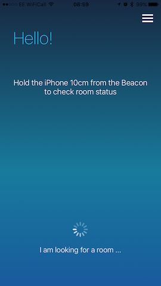
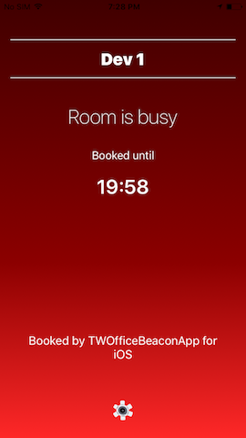
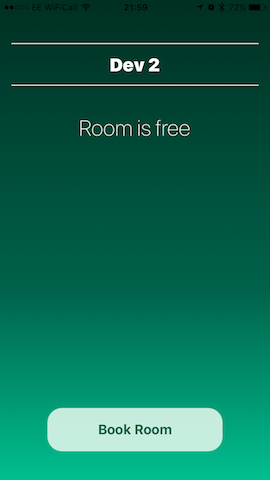

# iBOfficeBeacon

iBOfficeBeacon is a simple iOS app for offices to enable instant meeting room booking. It is based on iBeacon technology to determine user’s indoor location in an office, and is backed by Google Calendar as Calendar system.

The app is a context-aware iOS app that aims at creating a smart workplace for offices. It is at its very early stage now. Currently the app does the following:
- Display current status of the room (free/busy) based on the current location.
- Allow to book a room for up to 30 minutes, if room is free (for ad-hoc meetings).

This project is licensed under the Apache License, Version 2.0 [the "License”](./LICENSE).





## Table of contents:

1. [Getting started](#getting-started).
	1. [Setting up the project](#setting-up-the-project).
	2. [Requirements to run on a physical device](#requirements-to-run-on-a-physical-device).
	3. [Running the app in your iPhone for development](#running-the-app-in-your-iPhone-for-development)
2. [App Configurations](#app-configurations).
3. [iBeacons Emitters](#iBeacons-emitters).
4. [Project Management](#project-management).
	1. [Project roadmap](#project-roadmap).
	2. [Trello board](#trello-board).
5. [Third Party Libraries](#Third-party-libraries).
6. [Contribution](#contribution).

-----

# Getting started:
The project supports `iOS9` and above, is designed for iPhone, and written in `Swift 2.3`. The app supports **Google Calendar** as backend Calendar system.

## Setting up the project:
1. Install the latest Xcode from App Store.
2. Install CocoaPods: `sudo gem install cocoapods`.
3. cd to the cloned directory (default is iBOfficeBeacon).
4. Run: `pod install`.
5. Open `iBOfficeBeacon.xcworkspace` in Xcode.
6. Select iBOfficeBeaconDev schema from the toolbar.
7. Run the test to verify everything is OK.

## Requirements to run on a physical device:
The app requires the following two accounts to be setup:
- [Google API Console Account](#google-api-console-account).
- [HockeyApp Account](#hockeyapp-account) (Optional).

### Google API console account:
The app uses Google Calendar as a backend Calendar system. If you plan to use the app, then your office/workspace must be using [Google Calendar to manage meeting rooms](https://support.google.com/calendar/answer/44105?hl=en).

In order to use Google Calendar API, you will need to register this app in [Google Console](https://console.developers.google.com), check out [Using OAuth 2.0 to Access Google APIs](https://developers.google.com/identity/protocols/OAuth2), and [Using OAuth 2.0 for Mobile and Desktop Applications](https://developers.google.com/identity/protocols/OAuth2InstalledApp) for more details.

Lastly, the app uses Google Drive to fetch a spreadsheet, that contains beacon ID mapping to a room. The structure of the spreadsheet must be as following (including the headers):

|major 	|minor| office | room| calendar ID |
|--- |--- |--- |--- |--- |
|1 | 2| Manchester | Meeting Room 1| xxxxxxxx@group.calendar.google.com |
|1 | 4| Manchester | Meeting Room 3| yyyyyyyy@group.calendar.google.com |
|3 | 1| London | Meeting Room 12| zzzzzzzz@group.calendar.google.com |
|3 | 2| London | Meeting Room 31| aaaaaaaa@group.calendar.google.com |

You will need both the app client ID generated by google console and spreadsheet ID to assign them in [Assigning app setting keys](#assigning-app-setting-keys).

### HockeyApp account:
Optionally you can enable HockeyApp integration for the following features:
- Deploy via HockeyApp.
- Send in-app updates.
- Allow users to send feedback from the app.

By default, HockeyApp integration is disabled, you will need to enable it and set HockeyApp ID. More about this in [Assigning app setting keys](#assigning-app-setting-keys).

## Running the app in your iPhone for development: 
Before running the app in your iPhone, ensure that you have met the above [Requirements](#requirements-to-run-on-a-physical-device), and done [Assigning app setting keys](#assigning-app-setting-keys).

1. Login with your Apple Dev in Xcode (Create a free dev account from: https://developer.apple.com).
2. Generate a provisioning profile using Xcode.
	1. Select iBOfficeBeacon project from the Project Navigator.
	2. Select iBOfficeBeacon Target from Targets.
	3. In General under Identity, update the Bundle ID name to be unique to you (com.**NEW_NAME_HERE**.iBOfficeBeacon.dev)
	4. In General, under Singing, tick the box for Automatically Manage Singing.
3. [Skip if you enabled Xcode to automatically manage signing] Select `iBOfficeBeaconDev schema`, and set the provision profile for it.
	1. From Targets, select iBOfficeBeacon.
	2. Under signing (Debug), select the provision profile you generated in step 1.
4. Open `info.plist`, under `iBOfficeBeaconAppSettings`, fill in the required values for `dev` environment. More about [App Configuration here](#app-configurations).
5. Connect your iPhone and run the app.
6. If it is the first time running the app, the app will not run, but shows an alert instead. In your iPhone, go to Settings -> General -> Profile -> `YOUR_PROFILE` -> Trust Profile.

-----

# App Configurations:
There are 3 environments in the project, configured as 3 different Xcode schemes:

|Environment Name	|Xcode Scheme| Xcode Configuration | Used for| 
|---	 					|---	 |--- |--- |
|**Prod**			| iBOfficeBeaconRelease	| Release| Sign with a Distribution Cert |
|**Test**			| iBOfficeBeaconBeta | Beta | sign with AdHoc Cert |
|**Dev**			| iBOfficeBeaconDebug | Debug	| sign development provision profile for Local Development/CI |

The mapping between environment name and Xcode configuration is defined in the target `Build Settings` under `BUILD_ENVIRONMENT` as a User-Defined setting. Each of these environment has an entry in the `info.plist` file under `iBOfficeAppSettings` key. The app settings is read from the `info.plist` for the running environment.

## Assigning app setting keys:
Before running the app, open `info.plist`, and ensure you have assigned values to the following app setting keys:

|key name 	|value |required | 
|---	 |---	|--- |
|**GoogleClientID**| The client ID generated by Google Console for the app to access Google API	| Yes |
|**AddressSheetID**| The ID of the google spreadsheet that contains the mapping of beacon ids to rooms	| Yes |
|**BeaconUUID**| The UUID of your beacons. All beacons must share the same UUID in your company/office	| Yes |
|**HockeyAppID**	| The id of your app in HockeyApp. You need to enable HockeyAppIntegration in FeatureToggles | No |

## The structure of `iBOfficeAppSettings` key:
`iBOfficeAppSettings` value is a dictionary, with the key name as the setting name. The value of the setting name key is another dictionary, that contains the name of the environment as a key. The environment specific value is set for each key; `{”settingsName”: {“environmentName”: “value”}}`

There is a special case for `FeatureToggles` key. The value of this key is a dictionary with the keys as the name of the feature toggle. For each feature key, the value is another dictionary that contains the environments name as keys. The boolean value of the key is set for each environment; `{“FeatureToggles”:{”featureName”: {“environmentName”: “value”}}}`

Here is a JSON structure of the `iBOfficeAppSettings` in `info.plist`

```
“iBOfficeAppSettings”: {
	“settingName1: {
		“default”: “value”,
		“prod”: “value to be used with iBOfficeBeacon scheme”,
		“test”: “test value to be used with HockeyApp iBOfficeBeacon scheme”,
		“dev” : “test value to be used with iBOfficeBeaconDev scheme”
	},
	“FeatureToggles: {
		“FeatureName1”: {
			“default”: YES,
			“prod”: NO,
			“test”: NO,
			“dev” : YES
			},
		“FeatureName2”: {
			“default”: YES,
			“prod”: NO,
			“test”: NO,
			“dev” : YES
		},
		...
		...
	},
	...
	...
}

```

Going forward, a different mechanism to manage different environment will be added; [iOS multi-environment configuration](http://appfoundry.be/blog/2014/07/04/Xcode-Env-Configuration/).

-----

# iBeacons Emitters:
The project is using [Estimote Beacons](http://estimote.com).

-----

# Project Management:
## Project roadmap:
The roadmap can be viewed [here](https://docs.google.com/drawings/d/1NqITEbjW1hRoRXAXDtxKW2nj0kHTjqK7kF_uY7WfCgA/edit?usp=sharing).

## Trello board:
Trello board will be added very soon to give a view of what work is being carried on, and what is coming next.


-----

# Third Party Libraries:

- [SwiftCSV](https://github.com/naoty/SwiftCSV).
- [Estimote SDK for Apple iOS](https://github.com/Estimote/iOS-SDK).
- [HockeySDK-iOS](https://github.com/bitstadium/HockeySDK-iOS).
- [GTM OAuth 2](https://github.com/google/gtm-oauth2).
- [Google APIs Client Library for Objective-C For REST](https://github.com/google/google-api-objectivec-client-for-rest).

-----

# Contribution:
Your contribution is very welcomed. Feel free to submit pull request for bug fixing, refactoring, or new features.

Please note that this project is released with a [Contributor Code of Conduct](./CODE_OF_CONDUCT.md). By participating in this project you agree to abide by its terms.
